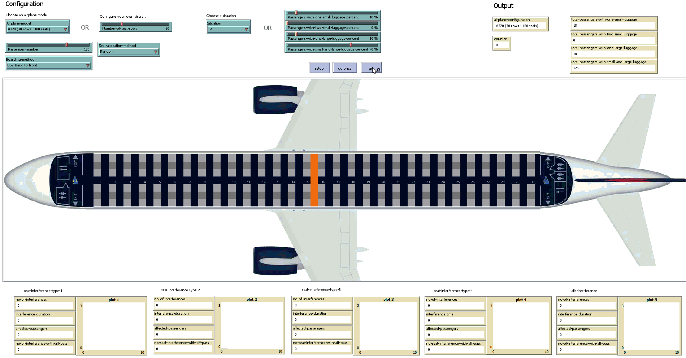
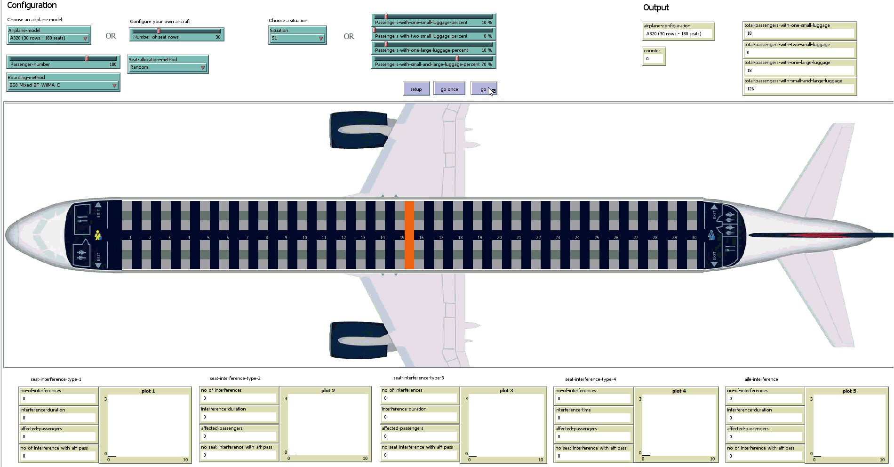
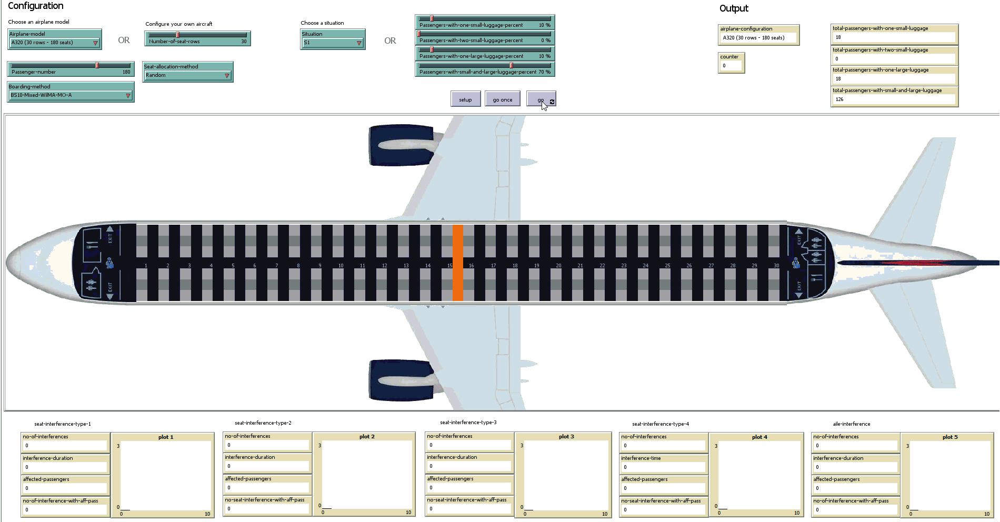
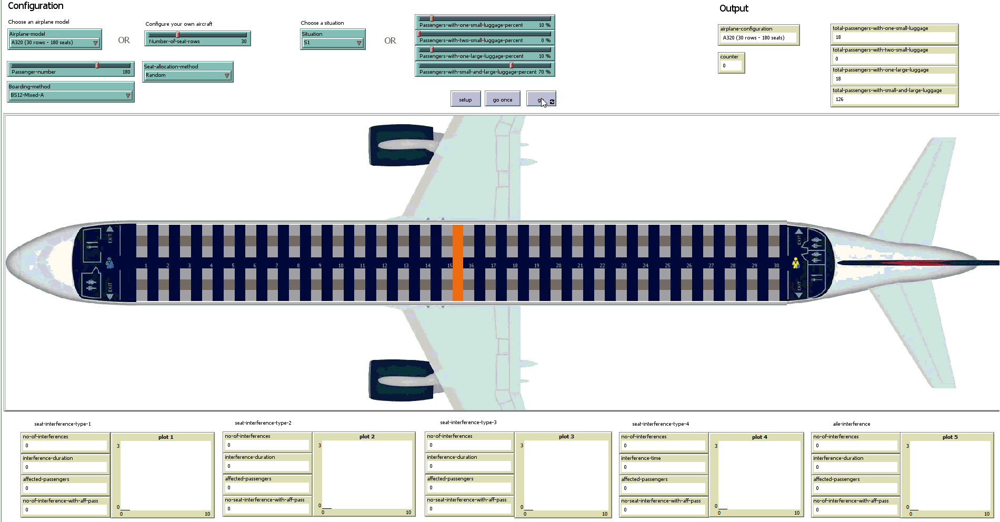

Please feel free to contact us at liviu.cotfas at ase .ro for the `NetLogo` source code.

# Scenarios

All the simulations have been performed using the following settings:
- luggage situation: **S1** (described in our paper);
- occupancy level: **100%** (180 passengers).

> Suggestion: You can download the animations below in order to watch them at a higher resolution.

## 1-Back-to-front

## 2-Adapted-WilMA

## 3-Mixed-BF-WilMA-A

## 4-Mixed-BF-WilMA-B

## 5-Mixed-BF-WilMA-C

## 6-Mixed-BF-WilMA-D

## 7-Mixed-WilMA-MO-A

## 8-Mixed-WilMA-MO-B

## 9-Mixed-A

## 10-Mixed-B

## 11-Mixed-C
